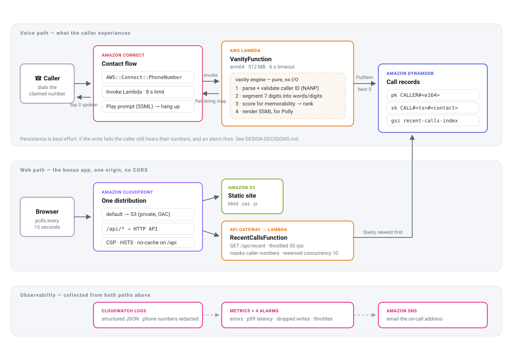
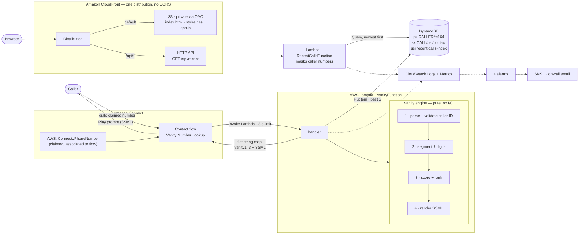

# Architecture

*(If the SVG does not render in your viewer, the same diagram is expressed in Mermaid
below.)*

---

## The voice path, step by step

1. **A call arrives** on a phone number claimed by `AWS::Connect::PhoneNumber` and pointed
   at the contact flow by a small custom resource (CloudFormation claims numbers but has no
   resource for associating one with a flow — see [DESIGN-DECISIONS](DESIGN-DECISIONS.md#the-last-mile-cloudformation-cannot-do)).

2. **The contact flow** enables flow logging, sets a neural Polly voice, greets the caller,
   and invokes `VanityFunction`. Connect allows the Lambda at most 8 seconds; the Lambda's
   own timeout is set to 6 so that *it* fails first and produces a real CloudWatch error
   instead of an opaque flow-side timeout.

3. **The Lambda** reads `Details.ContactData.CustomerEndpoint.Address`, runs the vanity
   engine, writes the best five results to DynamoDB, and returns a flat map of strings.

4. **The flow branches** on `$.External.status`. On `OK` it stamps `vanity1..3` onto the
   contact (so they appear in the contact trace record for support staff) and plays
   `$.External.vanitySpeechSsml`. On anything else it plays `$.External.message`, a
   sentence the Lambda already wrote for that specific reason. On a Lambda error or timeout
   it plays a fixed apology. **Every branch ends in a spoken sentence and a clean
   disconnect — there is no path on which the caller hears silence.**

## The vanity engine

Deliberately a pure function: no AWS SDK, no I/O, no clock, no randomness. That is what
makes it exhaustively unit-testable and what guarantees the same number always produces the
same ranked list, which matters because the results are persisted, read aloud, and asserted
on in tests.

| Stage | File | What it does |
| --- | --- | --- |
| Parse | `src/core/phone.ts` | Normalises to E.164, validates NANP structure, splits area code from the 7-digit subscriber number. Distinguishes *withheld*, *international*, and *malformed* so the IVR can say something specific. |
| Index | `src/core/dictionary.ts` | Builds a `digit-string → words` map from 23,873 committed words, once per cold start. |
| Segment | `src/core/vanity.ts` | Partitions the 7 subscriber digits into an ordered sequence of dictionary words and literal digit runs. |
| Score | `src/core/score.ts` | Ranks candidates on five weighted, named components. **[Why these five](DESIGN-DECISIONS.md#what-best-means).** |
| Speak | `src/core/speech.ts` | Renders SSML so Polly says "H-E-L-P" rather than "help". |

Only the **last seven digits** are spelled. The area code stays as digits, because that is
how real vanity numbers work — 1-800-FLOWERS keeps its NPA. `spellWindow` makes this
configurable.

The search is exponential in principle, but the input is fixed at 7 digits and both the
per-span word count and the total candidate count are capped, so p99 stays flat no matter
how letter-rich the number is. Measured: ~1–3 ms warm, ~30 ms on the cold start that builds
the index.

## Data model

One DynamoDB table, single-table style.

| | Attribute | Example |
| --- | --- | --- |
| Partition key | `pk` | `CALLER#+18884357669` |
| Sort key | `sk` | `CALL#2026-08-30T10:00:00.000Z#contact-abc` |
| GSI `recent-calls-index` PK | `gsi1pk` | `RECENT#0` |
| GSI `recent-calls-index` SK | `gsi1sk` | `2026-08-30T10:00:00.000Z#contact-abc` |
| | `callerNumber`, `contactId`, `requestedAt`, `vanityNumbers[]` | |
| TTL | `expiresAt` | epoch seconds, 90 days out |

**Partitioning by caller** makes "everything about this caller" a single-partition Query,
which is the access pattern support staff actually have. A **time-ordered sort key** makes
"their most recent call" a Query with `ScanIndexForward: false, Limit: 1` and no filtering.
Appending the contact id keeps the key unique when a caller manages two calls in the same
millisecond.

**The feed index** exists because "the last 5 callers *across all callers*" is the query
DynamoDB is worst at. `gsi1pk` is a sharded constant: `RECENT#<n>`, with the shard derived
by hashing the contact id. `RECENT_SHARD_COUNT` defaults to 1 (one partition, one Query),
and raising it spreads writes across N partitions while the reader fans out over N parallel
Queries and merges — no code change, no data migration. The reasoning and the alternatives
I rejected are in [`src/lib/repository.ts`](../src/lib/repository.ts).

The GSI projects only the four attributes the feed needs, not `ALL` — a narrower projection
is less to write on every single call.

## The web path

One CloudFront distribution serves both the static site and the API:

- default behaviour → S3, private, reachable only through Origin Access Control;
- `/api/*` → the HTTP API, caching disabled, `ALL_VIEWER_EXCEPT_HOST_HEADER`.

Same origin, so **there is no CORS configuration anywhere in this project** — no preflight
round trip, and no `Access-Control-Allow-Origin: *` to get wrong later. It also means one
place to attach WAF, a custom domain, and a certificate.

The API masks caller numbers (`+1888***7669`) before they leave the Lambda. The table holds
full numbers because the IVR and support tooling need them; the public read model does not
get them. That endpoint is nonetheless unauthenticated, which is a deliberate demo
shortcut — see [PRODUCTION-READINESS](PRODUCTION-READINESS.md#1-the-web-api-is-unauthenticated).

## Stacks

Three, so that each can be deployed independently and the most likely blocker (not having a
Connect instance) does not stop the rest.

| Stack | Contents | Requires |
| --- | --- | --- |
| `VanityCoreStack` | Table, IVR Lambda, log groups, metric filter, 4 alarms, SNS topic | nothing |
| `VanityConnectStack` | Contact flow, integration association, invoke permission, optional phone number + association | `-c connectInstanceArn=...` |
| `VanityWebStack` | Read Lambda, HTTP API, S3, CloudFront, security headers | nothing |

`VanityConnectStack` is only added to the app when `connectInstanceArn` is supplied, and the
ARN is regex-validated at synth time so a typo fails in two seconds rather than ninety.

## Observability

- **Structured JSON logs** with `contactId` and `awsRequestId` on every line, queryable
  directly in Logs Insights. Phone numbers are redacted to `+1888***7669` before they are
  written — CloudWatch Logs is not a PII store.
- **Four alarms**, all on one SNS topic: Lambda errors, p99 duration approaching the flow
  timeout, DynamoDB throttling, and a metric filter that catches *silent* persistence
  failures. That last one exists because dropped writes are invisible by design — the
  caller is served anyway — so without it they would never surface.
- **X-Ray active tracing** on both Lambdas.
- **Flow logging** is enabled as the first action in the contact flow. Without it, a call
  that "just hangs up" is undebuggable.
